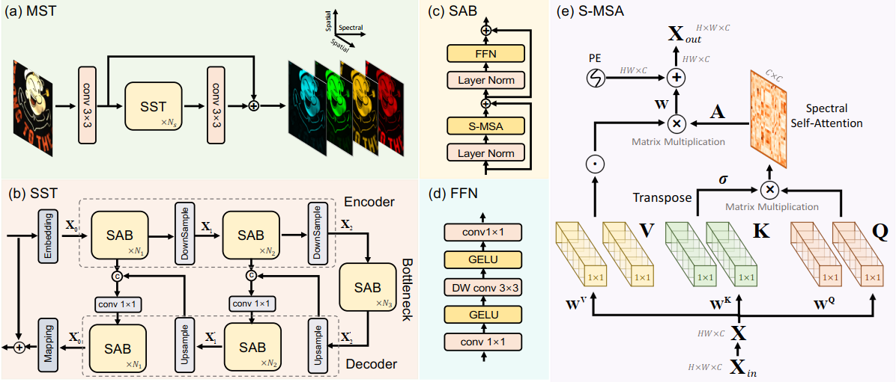
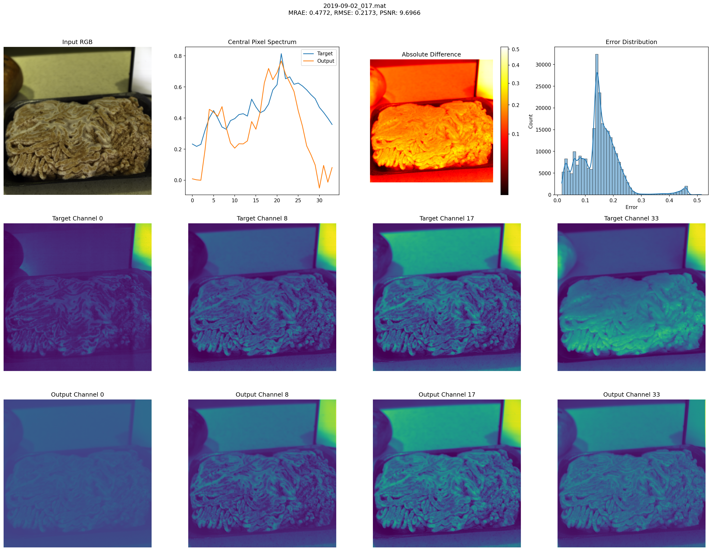

# Physically Plausible Spectral Reconstruction
In my project, I tried experimenting with the physically plausible spectrum method on various machine learning models. 
Namely, I initially ran it on regression and calculated all the metrics, then tested it on a perceptron and completed the training on Multi-stage Spectral-wise Transformer for Efficient Spectral Reconstruction. 
I also applied all the weights that I received during the training and the metrics. More details on how to train and test are described below.
## MST++: Multi-stage Spectral-wise Transformer for Efficient Spectral Reconstruction
Network architecture:  

The model was chosen because of the victory at the NTIRE 2022 competition and is currently a favorite in the field of spectral reconstruction.
### 1. Installation
1. Clone repository:
```python
    gh repo clone Asterialka/Physical_SR
```
2. Install package:
```python
cd MST-plus-plus
pip install requirements
```
### 2. Data Preparation:
1. If you want to train the model:
You can download KAUST dataset from [KAUST](https://repository.kaust.edu.sa/items/891485b4-11d2-4dfc-a4a6-69a4912c05f1)  
- Place the training spectral images to `/MST-plus-plus/dataset/Train_Spec/`  
- Place the training RGB images to `/MST-plus-plus/dataset/Train_RGB/.`
- Place the validation spectral images to `/MST-plus-plus/dataset/Valid_Spec/`  
- Place the validation RGB images to `/MST-plus-plus/dataset/Valid_RGB/.`  
- Example of true repo:
```python
|--MST-plus-plus
    |--test_challenge_code
    |--test_develop_code
    |--train_code  
    |--dataset 
        |--Train_Spec
            |--kaust_0001.h5
            |--kaust_0002.h5
            ： 
            |--kaust_0100.h5
  	|--Train_RGB
            |--kaust_0001.jpg
            |--kaust_0002.jpg
            ： 
            |--kaust_0100.jpg
        |--Valid_Spec
            |--kaust_0101.h5
            |--kaust_0102.h5
            ： 
            |--kaust_0120.h5
  	|--Valid_RGB
            |--kaust_0101.jpg
            |--kaust_0102.jpg
            ： 
            |--kaust_120.jpg
        |--split_txt
            |--train_list.txt
            |--valid_list.txt
```
### 3. Training
Then to train the model run:
```python
cd MST-plus-plus/train_code

# train MST++
python train.py --method mst_plus_plus  --batch_size 20 --end_epoch 300 --init_lr 4e-4 --outf ./exp/mst_plus_plus/ --data_root ../dataset/  --patch_size 128 --stride 8  --gpu_id 0

```
The training log and models will be saved in `/MST-plus-plus/train_code/exp/.`
### 4. Test code
- Place the testing RGB images to `/MST-plus-plus/dataset/Test_RGB/.`
- Place the testing spectral images to `/MST-plus-plus/dataset/Test_Spec/.`
```python
cd MST-plus-plus/test_develop_code

# test MST++
python test.py --data_root ../dataset/  --method mst_plus_plus --pretrained_model_path ./model_zoo/mst_plus_plus.pth --outf ./exp/mst_plus_plus/  --gpu_id 0
```
The entire visualization is also saved in `test_develop_code/exp/mst-plus-plus/visualizations`  
Example of visualization:  

### 5. My results

| Metric/Model | Model - 1 (23 epochs) | Model - 2 (28 epochs) | Model - 3 (6 epochs - FineTune) |
|--------------|-----------------------|-----------------------|---------------------------------|
| MRAE         | 0.72                  | 0.70                  | 0.69                           |
| RMSE         | 0.258                 | 0.253                 | 0.246                          |
| PSNR         | 10.17                 | 10.24                 | 10.31                          |
| dE00         | 0.00                  | 0.00                  | 0.00                           |

You can download weights - [Google disk](https://drive.google.com/drive/folders/1bxsLFpo2agqBbm_xM2_MgAsJqg5kpmVj?usp=sharing)
## Regression
Three types of regression are considered: pbf, root-poly, poly.  
You can download KAUST dataset from [KAUST](https://repository.kaust.edu.sa/items/891485b4-11d2-4dfc-a4a6-69a4912c05f1)  
- Place the training spectral images to `/Regression/data/`  
- Place the test spectral images to `/Regression/test_images/.`  
### 1. Training and testing
```python
cd Regression 
 python3 main.py #Для обучения и тестирования кода`
```
### 2. My results
Without Physically Plausible: 
| Metric/Model without Physically Plausible | ROOT-POLY - mean | POLY - mean | RBF - mean |
|--------------|-----------------------|-----------------------|---------------------------------|
| MRAE         | 0.278                  | 0.278                  | 0.375                           |
| dE00         | 0.0002                | 0.0002                 | 0.0016                          |
| dE00_A         | 0.0104                 | 0.0104                 | 0.0114                          |
| dE00_D65         | 0.0002                  | 0.0002                  | 0.0016                           |
| dE00_sony         | 0.0102                  | 0.0102                  | 0.0116                           |
| dE00_nikon         | 0.0064                  | 0.0062                  | 0.0075                           |
| dE00_canon         | 0.0054                  | 0.0054                  | 0.0066                           |
| nse        | 0.20                  | 0.20                  | 0.29                           |

With Physically Plausible:  
| Metric/Model with Physically Plausible | ROOT-POLY - mean | POLY - mean | RBF - mean |
|--------------|-----------------------|-----------------------|---------------------------------|
| MRAE         | 0.278                  | 0.278                  | 0.376                           |
| dE00         | 0.0000                | 0.0002                 | 0.0000                          |
| dE00_A         | 0.0104                 | 0.0104                 | 0.0108                          |
| dE00_D65         | 0.0000                  | 0.0002                  | 0.0000                           |
| dE00_sony         | 0.0102                  | 0.0102                  | 0.0111                           |
| dE00_nikon         | 0.0061                  | 0.0061                  | 0.0068                           |
| dE00_canon         | 0.0053                  | 0.0053                  | 0.0059                           |
| nse        | 0.20                  | 0.20                  | 0.29                           |

You can find your learning outcomes in the folder `Regression/results/.`  
And also download the weights I trained using the link: [Google disk](https://drive.google.com/drive/folders/1I9KrseAVy11SaIQ8tHVo_ygF-ZnAfwBd?usp=sharing) 
